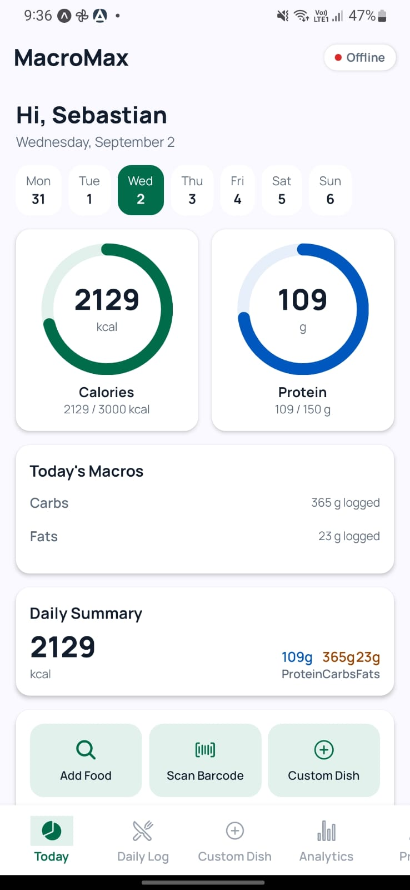
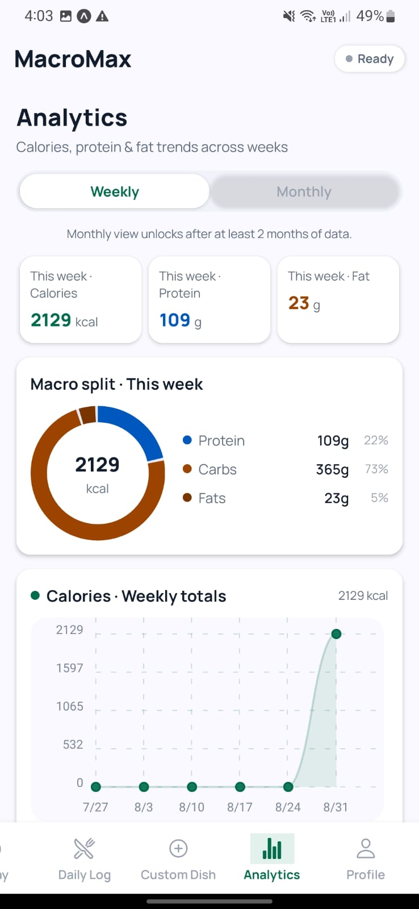
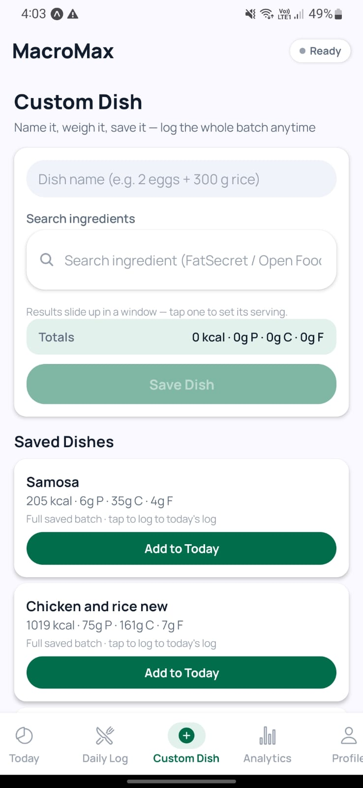
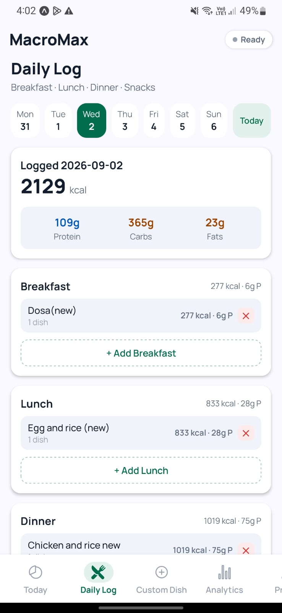
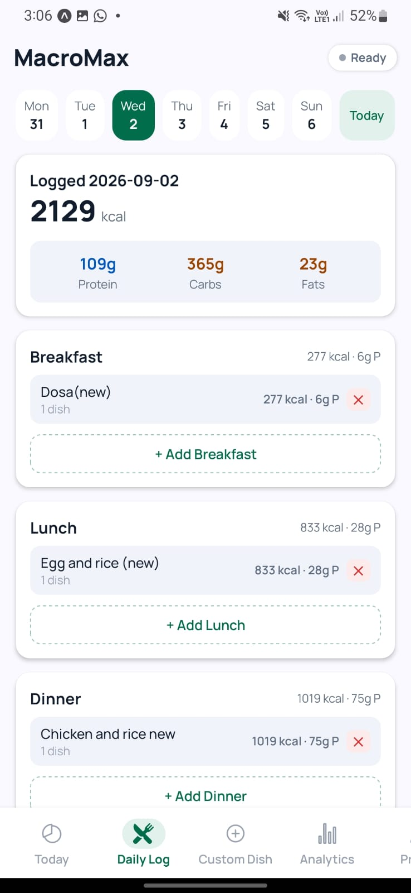
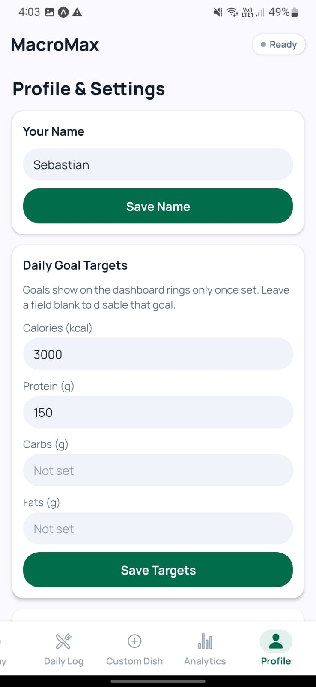

# MacroMax

**A standalone, offline-first macro & nutrition tracker for Android.**

Built natively with React Native (Expo), TypeScript, and NativeWind — no account required, all data lives on-device.


---

## Table of Contents

- [Screenshots](#-screenshots)
- [Features](#features)
- [Tech Stack](#tech-stack)
- [Getting Started](#getting-started)
- [Environment Variables](#environment-variables)
- [Data Providers](#data-providers)
- [Testing](#testing)
- [Project Structure](#project-structure)

---

## 📱 Screenshots

| Today's Overview | Daily Log | Custom Dish Builder |
| :---: | :---: | :---: |
|  |  |  |

| Food Search & Sliding Window | Analytics Dashboard | Profile & Settings |
| :---: | :---: | :---: |
|  |  |  |

---

## Features

**Tracking**
- **Today's Overview** dashboard with animated goal rings (Calories · Protein) and macro bars (Carbs · Fats)
- **Daily Log** for managing meals across Breakfast, Lunch, Dinner and Snacks/Extra
- **Custom Dish** builder — name a dish, pick ingredients + servings, save it as a one-tap loggable batch
- Customizable daily targets for calories, protein, carbs, and fats
- Weekly / monthly analytics

**Food Search**
- Barcode scanning via `expo-camera` → **Open Food Facts V2** product endpoint
- Text search via **FatSecret Platform API** (OAuth 2.0, raw ingredients & dishes) + **Open Food Facts** (packaged products)
- Serving-aware logging: grams, pieces/units, and provider **standard portions** (including ml-based servings)
- Debounced, input-isolated search UI (no typing latency), with an offline cache for repeat lookups

**Navigation & UX**
- Horizontal **sliding-window bottom navigation** (safe-area aware) across Today, Daily Log, Custom Dish, Analytics and Profile

---

## Tech Stack

| Layer | Technology |
| --- | --- |
| Framework | React Native / Expo SDK 52 |
| Routing | Expo Router v4 (sliding custom tab bar) |
| Language | TypeScript (`strict: true`) |
| Styling | NativeWind (Tailwind CSS) with the **Vitality Core** design tokens (Manrope) |
| Storage | AsyncStorage (offline-first, no account required) |
| Charts | `react-native-chart-kit` for analytics |

---

## Getting Started

### Prerequisites

- Node.js and npm
- Expo CLI (`npx expo`)
- An Android device or emulator

### Installation

1. Install dependencies:

   ```bash
   npm install
   ```

2. Configure food providers — copy `.env.example` to `.env` and fill in the values (see [Environment Variables](#environment-variables)).

3. Start the app:

   ```bash
   npm start
   ```

### Building a Standalone APK

```bash
npx expo prebuild
cd android && ./gradlew assembleRelease
```

---

## Environment Variables

| Variable | Required | Description |
| --- | --- | --- |
| `EXPO_PUBLIC_FATSECRET_CLIENT_ID` | Yes | FatSecret Platform API client ID (required for ingredient/dish text search) |
| `EXPO_PUBLIC_FATSECRET_CLIENT_SECRET` | Yes | FatSecret Platform API client secret |
| `EXPO_PUBLIC_OFF_USER_AGENT` | Recommended | Custom Open Food Facts User-Agent |

---

## Data Providers

| Flow | Provider | Notes |
| --- | --- | --- |
| Barcode scanning | Open Food Facts V2 `…/api/v2/product/{barcode}.json` | Custom `User-Agent` header required |
| Packaged products | Open Food Facts search (`cgi/search.pl`) | Serving sizes mapped to portions |
| Raw ingredients & dishes | FatSecret Platform API (`food.search`/`foods.search`, `food.get`, OAuth 2.0 client-credentials) | Serving table → standard portions (g & ml) |
| Repeat lookups | On-device AsyncStorage cache | Offline-friendly |
| Last resort | Built-in reference list | Never hangs empty |

---

## Testing

**Status: ✅ 195 / 195 unit tests passing** (Node built-in test runner via `tsx`), plus a strict `tsc --noEmit` type-check. Tests exercise the **real `src/lib` modules** (pure logic only — no native/network dependencies), so they verify actual app behaviour rather than copies of it.

```bash
npm test           # run all unit tests
npm run typecheck  # strict TypeScript check (app + tests)
npm run ci         # typecheck + tests (what CI runs)
```

GitHub Actions (`.github/workflows/ci.yml`) runs both jobs on every push to `main`/`feature/*` and on PRs targeting `main`.

| Suite | File | Tests | What it ensures |
| --- | --- | --- | --- |
| Nutrition engine | `test/nutrition.test.ts` | 38 | Macro add/scale/totals math, goal mapping, low-intake alerts at the 50% threshold, date helpers (`toLocalDateString`, `startOfWeek`, `addDays`, `getDateNDaysAgo`), rolling 7-day averages, meal-slot grouping |
| Serving units | `test/servingUnits.test.ts` | 50 | Piece-size rules (egg/roti/banana… incl. specificity & case/whitespace), grams conversion, quantity parsing, grams/pieces/portion modes, portion multipliers, pluralisation, settings reference table |
| Food-search pipeline (`api`) | `test/api.test.ts` | 40 | Result dedupe (barcode → externalId → source+name), cache eligibility (only FatSecret/Open Food Facts), cache-row mapping incl. 2-dp rounding & portions, cache-row → result mapping, legacy `ifct2017`/`usda` row migration, **relevance sorting** (basic → prepared → complex, exact/prefix phrase priority, raw-before-cooked, custom-dish pinning, stability) |
| Offline fallback database | `test/fallbackFoods.test.ts` | 15 | Case-insensitive substring search, macro values of key foods, Indian staple coverage, result shape (`fallback` source, `100 g` serving, stable ids) |
| HTTP helpers | `test/http.test.ts` | 16 | Defensive numeric coercion (`toNumber`) and RFC-4648 base64 used for FatSecret OAuth Basic auth (`toBase64`) |
| FatSecret mapping | `test/fatSecret.test.ts` | 14 | Description parsing (`Per 100g - …`), `100 g`/default serving → per-100g derivation, single-serving JSON quirk, ml portions (1 ml ≈ 1 g), portion cap/dedupe, rejection of unusable foods |
| Sync-status store | `test/syncStatus.test.ts` | 12 | Header pill modes: online / local / cached / mixed / offline / idle, pub/sub notifications & unsubscribing |
| Open Food Facts mapping | `test/openFoodFacts.test.ts` | 10 | Per-100g mapping, kJ→kcal fallback, per-serving → per-100g scaling, standard portions from `serving_size`/`serving_quantity`, 2-dp precision, rejection of unusable products |

While building this suite, the tests surfaced and fixed two real defects:
- A missing export (`mapFatSecretSearchItem`)
- A **cache-eligibility bug** in the search pipeline — results were filtered against the whole result object instead of its `source`, so every remote result was silently skipped when writing the offline cache
- A **FatSecret description parser bug** — calories in the `Per 100g - Calories: …` segment were parsed as 0 because of an over-anchored regex

---

## Project Structure

```text
app/                    # Expo Router screens (tabs: index=Today, log, recipe, analytics, settings)
components/             # Reusable UI components (incl. ScrollableTabBar, AddFoodSheet, ServingInput)
src/hooks/              # Data hooks
src/lib/                # Local storage, nutrition, provider clients (fatSecret.ts, openFoodFacts.ts)
src/theme/              # Vitality Core semantic colors + shadow styles
src/types/              # Shared TypeScript types
test/                   # Unit tests (Node test runner + tsx)
.github/workflows/      # CI pipeline (typecheck + unit tests)
```